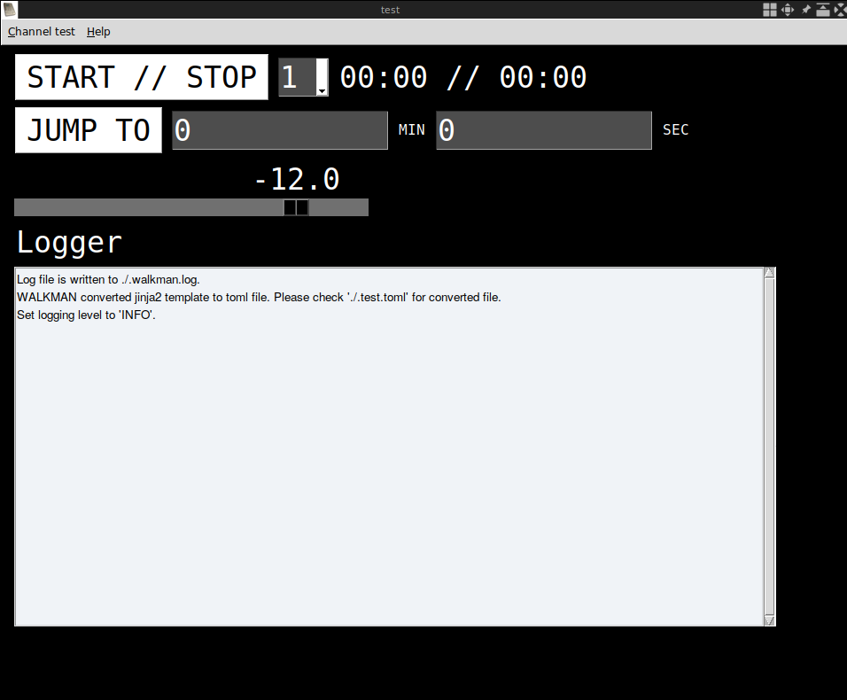

# walkman

[](https://circleci.com/gh/audiowalkman/walkman)
[](https://www.gnu.org/licenses/gpl-3.0)
[](https://badge.fury.io/py/audiowalkman)
[](https://github.com/psf/black)

Walkman is a minimalistic, robust software to trigger (audio) cues in performance contexts.
It uses [pyo](http://ajaxsoundstudio.com/software/pyo/) as its backend and [pysimplegui](https://pypi.org/project/PySimpleGUI/) as its frontend.
It can be configured by [toml](https://toml.io/en/) files.



## Rationale

Live-electronic setups tend to be messy, difficult to maintain and difficult to test.
Furthermore many compositions with live-electronics make use of cue-based pattern, but in most of electronic music frameworks (Pd, Max/MSP, ...) no default implementation exists.
`walkman` aims to improve the situation by providing a simple, declarative configuration language to setup programs based on cues.
The actual software is implemented in Python3, can be extended in python3 and can be tested with unit tests.

## Installation

walkman is available on pip:

```bash
pip3 install audiowalkman
```

Alternatively you can use [Nix](https://nixos.org/) to install walkman.

## Configuration file

```toml
[configure]
name = string                                                       (default to "Project")
logging_level = "info" | "error" | "warning" | "debug" | "notset"   (default to "info")

[configure.audio]
audio = string                                                      (default to "jack")
midi = string                                                       (default to "jack")
sampling_rate = integer                                             (default to 44100)
buffer_size = integer                                               (default to 1024)
channel_count = integer                                             (default to 2)

[configure.module.MODULE_NAME.REPLICATION_KEY]

[cue.CUE_NAME.MODULE_NAME.REPLICATION_KEY]
```

## Usage

```bash
walkman my_composition.toml
```

## Tests

### Automatic

With nix tests can be run with a newly compiled isolated setup:


```bash
nix-build default.nix
```

### Manual

Please consult the respective [README](https://github.com/audiowalkman/walkman/blob/main/tests/manual/README.md).
